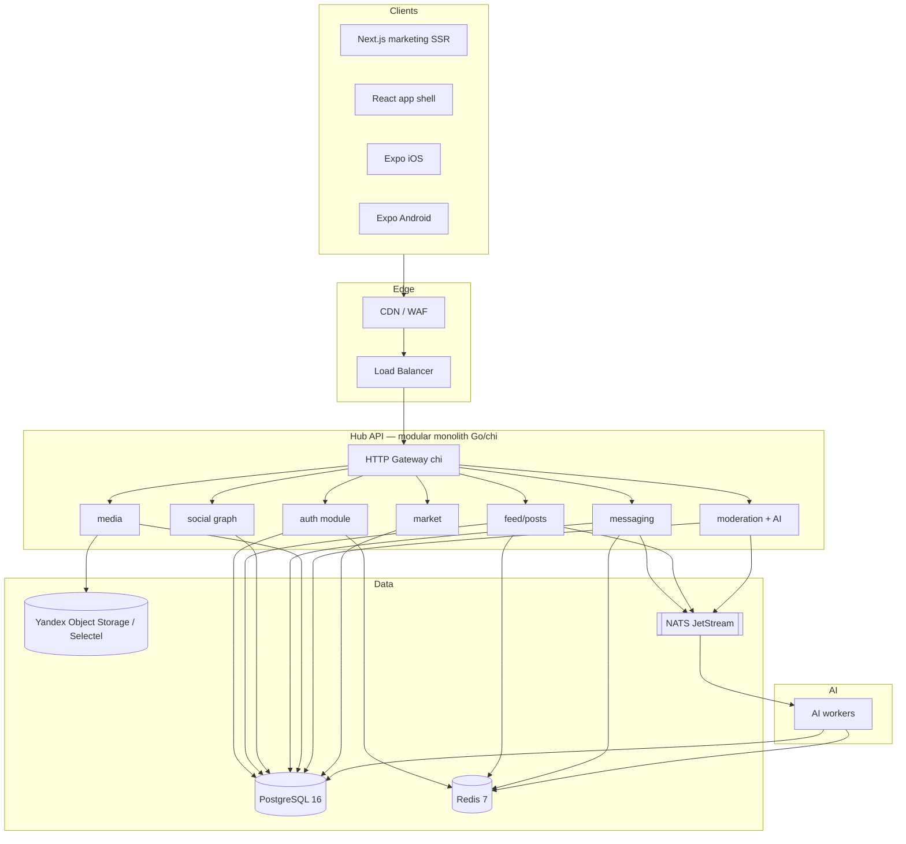
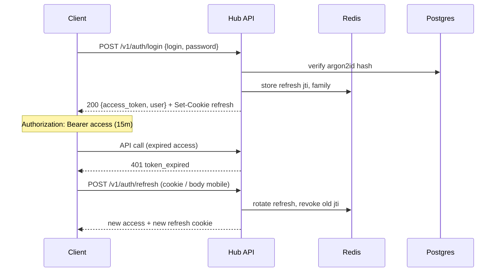

# Hub — Production Architecture (Parts 1–4)

**Продукт:** Hub — социальная сеть в стиле Threads  
**Регион запуска:** Россия (сентябрь 2026)  
**Клиенты:** Web + iOS + Android  
**AI:** гибридный (on-device лёгкие задачи + серверный inference)  
**Версия документа:** 1.0 · сентябрь 2026  
**Охват:** части 1–4 (архитектура/стек, auth/security, API, design system)

---

## Gap-анализ: что уже есть vs что нужно

Сравнение текущего Hub MVP (`/workspace/hub`) с production-целью.

| Область | Есть сейчас (MVP) | Нужно для production | Приоритет |
|--------|-------------------|----------------------|-----------|
| **Frontend shell** | Vite + React 19 + TS, React Router 7, Tailwind v4 | Next.js App Router (marketing/SSR/SEO) + сохранение React SPA shell для app; shared UI package | P0 |
| **State** | Zustand + `persist` → `localStorage` (`hub-app-v1`) | Zustand/TanStack Query + remote API; localStorage только UI prefs/cache | P0 |
| **Auth** | Демо-логин локально (логин `филипп` / пароль `demo`; любой ≥4 символов) | JWT access 15m + refresh; httpOnly cookie (web) / secure storage (mobile); OAuth VK/Yandex/Apple/Google/Telegram; 2FA SMS/TOTP | P0 |
| **Backend** | Нет | Modular monolith Go (chi) + Postgres + Redis + S3 + NATS | P0 |
| **Данные** | Сиды в `src/data/seed.ts` | Реальные сущности, миграции, индексы, soft-delete, audit | P0 |
| **Экраны** | Welcome, Login, Register, PasswordReset, Feed, Market, Messages/Chat, Compose, Activity, Profile, EditProfile, Settings | Те же + push, realtime, модерация, поиск, блокировки, репорты; Music — **out of scope** (как в MVP) | P0–P1 |
| **UI** | Threads-like, true black, PhoneShell iPhone 13 Pro Max (428×926), floating pill nav | Полный design system (токены HEX/px), light/dark, a11y WCAG 2.2 AA, desktop layout ≥1024 | P0 |
| **Превью** | Cloudflare tunnel preview | Staging на Yandex Cloud / Selectel; CI/CD; feature flags | P1 |
| **Mobile native** | Нет (только mobile web shell) | React Native (Expo) + shared TS types/API client | P1 |
| **Media** | Нет реального upload | Presigned S3 (Yandex Object Storage / Selectel), CDN, image pipeline (AVIF/WebP) | P0 |
| **Realtime** | Нет | WebSocket gateway + NATS; typing/presence/DM | P1 |
| **AI** | Нет | Hybrid: клиентский rewrite/suggest + серверный moderation/ranking/embeddings | P2 |
| **Market** | Демо-каталог, «В корзину» toast без оплаты | Каталог + корзина + эквайринг (ЮKassa/CloudPayments), 152-ФЗ | P2 |
| **Compliance** | Нет | 152-ФЗ, согласие cookie, хранение ПДн в РФ, политика удаления | P0 |
| **Observability** | Нет | OpenTelemetry, Sentry, метрики Prometheus, structured logs | P1 |
| **Music** | Нет | **Не планируется** на launch | — |

```
MVP (сейчас)                    Production (цель)
┌─────────────────────┐         ┌──────────────────────────────────────┐
│ Vite SPA + localStore│  ──►   │ Next marketing + React app shell     │
│ Demo auth            │         │ Go modular monolith + Postgres/Redis │
│ Seed feed/DM/market  │         │ JWT/OAuth + S3 + NATS + Expo RN      │
│ CF tunnel preview    │         │ Staging RF + CI/CD + 152-ФЗ          │
└─────────────────────┘         └──────────────────────────────────────┘
```

**Итог gap:** UI/UX-скелет и доменная модель экранов готовы (~30% UX). Нет backend, real auth, media, realtime, compliance — это ~70% работы до launch-ready MVP production.

**Оценка закрытия gap (суммарно Parts 1–4 foundation):** ~95–120 person-days до «скелет production» (без полного feature-complete).

---

# Часть 1. Architecture & stack

**Effort:** 18–22 person-days (ADR, skeleton repo, CI, infra baseline, shared packages).

## 1.1 Высокоуровневая архитектура



**Принцип:** modular monolith first → extract services later. Один deployable binary/process group; внутренние границы — Go packages (`internal/auth`, `internal/feed`, …) с чёткими API и запретом cross-import «мимо facade».

## 1.2 Backend: сравнение и выбор

| Критерий | **Go + chi (выбор)** | NestJS | FastAPI |
|----------|----------------------|--------|---------|
| Perf / lat p99 | Отлично, низкий RAM | Хорошо | Хорошо (GIL/async нюансы) |
| Hiring RF 2026 | Сильный Go-пул в fintech/SaaS | Большой TS-пул | Python-пул (ML-heavy) |
| Monolith → services | Простые binary extract | Модули Nest → микросервисы | FastAPI apps split |
| AI integration | gRPC/HTTP к Python workers | Нативно TS + Python sidecar | Лучший для ML in-process |
| Ops | Один static binary | Node runtime | Python runtime |
| Time-to-MVP API | Средний | Быстрый (decorators) | Самый быстрый |

**Выбор: Go 1.23+ + chi v5** как primary API.

**Почему не NestJS:** один язык с фронтом удобен, но для high-QPS feed/DM и дешёвого horizontal scale в РФ Go даёт предсказуемее cost/latency. Nest оставить кандидатом для BFF/admin, не для core.

**Почему не FastAPI primary:** идеален для AI/moderation workers (и мы его используем там), но dual-runtime для всего core усложняет hiring/ops на старте.

**Альтернатива fiber:** отвергнута — chi ближе к stdlib `net/http`, проще middleware-экосистема и аудит безопасности.

### Стек backend (concrete)

| Слой | Выбор | Обоснование (2–3 строки) |
|------|-------|--------------------------|
| Language | Go 1.23+ | Стабильный LTS-цикл, отличный tooling, один binary для k8s/VM. |
| HTTP | chi v5 | Idiomatic routing, middleware stack, совместим с `net/http` и OpenTelemetry. |
| DB | PostgreSQL 16 + pgx/v5 | JSONB для flexible post meta, FULL TEXT (russian), партиции feed later. |
| Migrations | golang-migrate / goose | SQL-first, reviewable, CI-gated. |
| Cache/sessions | Redis 7 | Refresh token denylist, rate limit, feed cache, presence. |
| Object storage | Yandex Object Storage (S3) или Selectel | Данные в РФ, S3 API, CDN. Primary: Yandex; fallback Selectel. |
| Queue | NATS JetStream | Легче Kafka для старта; subject-based fanout для feed fanout/AI/push. Альтернатива: RabbitMQ если команда уже знает AMQP. |
| Config | env + `koanf` | 12-factor, секреты из Lockbox/Vault. |
| Validation | `go-playground/validator` | Struct tags → единый error shape. |
| Logging | zap / slog | Structured JSON, trace_id. |
| Metrics | Prometheus + OTel | Стандарт RF/облаков. |

## 1.3 Frontend Web

| Слой | Выбор | Обоснование |
|------|-------|-------------|
| Marketing / SEO | **Next.js 15 App Router** | SSR лендинга, блог, legal (152-ФЗ), OG tags, App Store / deep links. |
| App shell | **Vite + React 19** (текущий MVP) → постепенно в monorepo `apps/web-app` | Уже есть Threads UI; не переписывать всё в RSC day 1. Hybrid: Next для `/`, `/about`, `/legal/*`; app на `app.hub.ru` или `/app/*` как SPA. |
| UI shared | `packages/ui` (React) | Токены + компоненты для Next и app shell. |
| Styling | Tailwind v4 (как сейчас) | Уже в MVP; design tokens в `@theme`. |
| Data | TanStack Query v5 + Zustand | Query для server state; Zustand для UI (compose sheet, toast). |
| Routing app | React Router 7 | Сохранить из MVP. |

**Hybrid схема:**

```
hub.ru          → Next.js (SSR marketing, legal, auth landing)
app.hub.ru      → React SPA (feed, messages, profile) — текущий код
api.hub.ru      → Go chi
cdn.hub.ru      → media CDN
```

## 1.4 Mobile

| Слой | Выбор | Обоснование |
|------|-------|-------------|
| Framework | **React Native + Expo SDK 52+** | Один TS-код с web types; EAS Build для iOS/Android; OTA updates. |
| Navigation | Expo Router | File-based, близок к web mental model. |
| Shared | `packages/api-client`, `packages/types` | OpenAPI → TS client; zod schemas. |
| Storage | expo-secure-store | Refresh tokens. |
| Push | APNs + FCM через Expo Notifications | Стандарт. |

**Не выбираем** Flutter day 1: сильнее изоляция от web TS; медленнее shared types с текущим React MVP.

## 1.5 Infra (RF 2026)

| Компонент | Выбор | Обоснование |
|-----------|-------|-------------|
| Cloud | **Yandex Cloud** (primary) / Selectel (DR) | Резидентность ПДн, managed Postgres/Redis/K8s, Object Storage. |
| Compute | Managed Kubernetes или serverless containers → старт: 2× VM + Docker Compose staging | Дешевле на старте; k8s при >3 сервисах. |
| DB | Managed PostgreSQL 16 (YC MDB) | Бэкапы PITR, HA. |
| Redis | Managed Redis | Persistence AOF для session-critical. |
| CDN | Yandex CDN / Cloudflare (если допустимо для статики без ПДн) | Статика/медиа; API — через LB в РФ. |
| Secrets | Yandex Lockbox | Не хранить в git. |
| CI/CD | GitHub Actions / GitLab CI → build → registry → deploy | Preview env на PR. |
| WAF/DDoS | Yandex DDoS Protection + rate limit на edge | RF-нагрузки и боты. |

### ASCII deploy (staging → prod)

```
[Git push] → CI (lint/test/build)
              ├─ docker: hub-api
              ├─ docker: hub-web-next
              ├─ docker: hub-ai-worker (FastAPI)
              └─ migrate Postgres
                    ↓
            Staging (YC)  →  smoke e2e
                    ↓
            Prod canary 10% → 100%
```

## 1.6 AI hybrid

| Задача | Где | Модель/подход |
|--------|-----|----------------|
| Compose assist (rewrite, tone) | Client-light + server | On-device мелкие подсказки; server LLM для полного rewrite |
| Moderation NSFW/hate | Server workers (FastAPI) | Classifier + human queue |
| Feed ranking features | Server | Embeddings + rules; feature store в Redis/PG |
| Search semantic | Server | pgvector или отдельный index later |

Workers подписаны на NATS subjects: `moderation.post.created`, `ai.embed.post`.

## 1.7 Риски и митигации (Part 1)

| Риск | Митигация |
|------|-----------|
| Переразбиение на микросервисы слишком рано | ADR: monolith до 50k DAU или явного bottleneck; package boundaries enforced в CI (`go-arch-lint`) |
| Vendor lock Yandex | S3-compatible API + Terraform modules с Selectel dual |
| Dual web (Next + Vite) drift | Shared `packages/ui` + Chromatic/Storybook; один design token source |
| Go hiring delay | NestJS BFF только для admin; core остаётся Go |

**Effort breakdown Part 1:** ADR+repo monorepo 3d · API skeleton 5d · infra staging 5d · shared packages 3d · CI 2d · buffer 2–4d ≈ **18–22 pd**.

---

# Часть 2. Auth & security — полная схема

**Effort:** 20–28 person-days (auth module, OAuth providers, session, hardening, audits).

## 2.1 Цели

- Парольный вход + OAuth: **VK ID, Yandex ID, Apple, Google, Telegram Login**
- Access JWT **15 минут**; refresh **30 дней** (sliding)
- Web: refresh в **httpOnly; Secure; SameSite=Lax** cookie
- Mobile: refresh в **SecureStore** / Keychain
- Соответствие 152-ФЗ: согласие, минимизация, право на удаление

## 2.2 Потоки (mermaid)



### OAuth (пример VK)

```
GET  /v1/auth/oauth/vk/start → redirect to VK
GET  /v1/auth/oauth/vk/callback?code=… → upsert user → session как login
```

Telegram: widget / Login URL → `hash` verify HMAC-SHA256 с bot token.

## 2.3 Token design

**Access JWT (claims):**

```json
{
  "iss": "https://api.hub.ru",
  "sub": "usr_01J8XK…",
  "sid": "ses_01J8XL…",
  "ver": 3,
  "scope": ["user"],
  "iat": 1790000000,
  "exp": 1790000900,
  "jti": "atk_…"
}
```

- Алгоритм: **EdDSA (Ed25519)** или RS256; ключи в Lockbox, rotation 90 дней.
- `ver` — password/session version: при смене пароля все access с `ver < current` отвергаются.

**Refresh:** opaque random 32 bytes (или JWT с `jti`), хранится в Redis:

```
refresh:{jti} → { user_id, session_id, family_id, ua_hash, exp }
```

Rotation: каждый refresh выдаёт новый jti; старый → denylist; reuse старого → revoke **всей family** (theft detection).

## 2.4 Password & secrets

| Параметр | Значение |
|----------|----------|
| Hash | argon2id, m=64MB, t=3, p=1 |
| Min length | 8 (prod), check HaveIBeenPwned k-anonymity optional |
| Reset | 6-digit OTP TTL 10m, max 5 attempts; или magic link 15m |
| Login lockout | 5 fails / 15m per account+IP → progressive delay |

## 2.5 Session & cookies (web)

```
Set-Cookie: hub_refresh=<opaque>; Path=/v1/auth; HttpOnly; Secure; SameSite=Lax; Max-Age=2592000
```

CSRF: для cookie-authenticated refresh — **double-submit** `hub_csrf` (readable) + header `X-CSRF-Token` на state-changing auth endpoints. API Bearer access не требует CSRF.

CORS: allowlist `https://hub.ru`, `https://app.hub.ru`, Expo dev origins staging only.

## 2.6 OAuth providers (RF bias)

| Provider | Зачем | Примечание |
|----------|-------|------------|
| VK ID | Основная аудитория РФ | Обязателен |
| Yandex ID | Широкий охват | Обязателен |
| Telegram | Низкий friction | Bot domain verify |
| Apple | App Store requirement | Sign in with Apple |
| Google | iOS/Android + web | Может быть ограничен для части пользователей РФ — не единственный путь |

## 2.7 Authorization model

- Roles: `user`, `moderator`, `admin`
- Resource checks: post author, chat participant, block list
- Soft blocks: скрытие контента; hard ban: `users.status=banned`

## 2.8 Security controls checklist

| Контроль | Реализация |
|----------|------------|
| TLS | 1.2+ everywhere; HSTS |
| Rate limit | Redis token bucket: auth 10/min/IP; write 30/min/user; read 120/min/user |
| Headers | `CSP`, `X-Content-Type-Options=nosniff`, `Referrer-Policy=strict-origin-when-cross-origin` |
| Upload | Magic-byte sniff, max 20MB image / 100MB video; virus scan async |
| PII | Encrypt at rest phone/email optional field-level; backups encrypted |
| Audit | `audit_log` table: login, password_change, oauth_link, admin actions |
| Secrets | No secrets in client; mobile cert pinning optional phase 2 |
| Dependency | `govulncheck`, `npm audit` in CI |
| 2FA | TOTP optional phase 1.5; SMS via SMSC/Twilio-like RF gateway |

## 2.9 Sample OpenAPI / JSON — login

**Request** `POST /v1/auth/login`

```json
{
  "login": "philip@hub.app",
  "password": "demo-only-not-for-prod",
  "device": {
    "id": "dev_01J…",
    "platform": "web",
    "name": "Chrome macOS"
  }
}
```

**Response 200**

```json
{
  "access_token": "eyJhbGciOiJFZERTQSJ9…",
  "token_type": "Bearer",
  "expires_in": 900,
  "user": {
    "id": "usr_01J8XK7N…",
    "username": "philip",
    "display_name": "Филипп",
    "avatar_url": null
  }
}
```

**Error 401**

```json
{
  "error": {
    "code": "invalid_credentials",
    "message": "Неверный логин или пароль",
    "request_id": "req_01J…"
  }
}
```

**Refresh** `POST /v1/auth/refresh` — web: cookie only; mobile:

```json
{ "refresh_token": "rft_…" }
```

## 2.10 Threat model (кратко)

| Угроза | Митигация |
|--------|-----------|
| XSS → token theft | Access в memory; refresh httpOnly; CSP |
| Refresh theft | Rotation + family revoke |
| Credential stuffing | Rate limit + CAPTCHA после 3 fails (Yandex SmartCaptcha) |
| Account takeover OAuth | Email verify on link; notify existing sessions |
| IDOR | UUID/ULID + ownership checks в каждом handler |

## 2.11 Риски Part 2

| Риск | Митигация |
|------|-----------|
| Google OAuth нестабилен в РФ | VK/Yandex/Telegram как primary; Google optional |
| Cookie SameSite на webview | Deep link + custom scheme для mobile OAuth |
| argon2 CPU cost | Dedicated auth instances; tune params under load test |

**Effort:** password+JWT 6d · refresh/rotation 4d · OAuth×5 8d · 2FA/reset 3d · hardening/tests 4d · buffer ≈ **20–28 pd**.

---

# Часть 3. API design

**Effort:** 16–22 person-days (OpenAPI, versioning, core endpoints, codegen client, docs portal).

## 3.1 Общие правила

| Правило | Значение |
|---------|----------|
| Base URL | `https://api.hub.ru/v1` |
| Format | JSON UTF-8 |
| Auth | `Authorization: Bearer <access>` |
| IDs | ULID/UUIDv7 строки `usr_`, `pst_`, `msg_` |
| Time | RFC3339 UTC; клиент конвертирует в Europe/Moscow |
| Pagination | Cursor: `?limit=20&cursor=eyJ…` |
| Errors | Единый envelope (см. ниже) |
| Idempotency | Header `Idempotency-Key` на POST create |
| Localization | `Accept-Language: ru` default |

**Error envelope:**

```json
{
  "error": {
    "code": "validation_failed",
    "message": "Проверьте поля формы",
    "details": [{ "field": "username", "issue": "taken" }],
    "request_id": "req_01J…"
  }
}
```

HTTP mapping: 400 validation · 401 auth · 403 forbid · 404 · 409 conflict · 429 · 5xx.

## 3.2 Versioning

- URI version: `/v1`, `/v2` при breaking changes.
- Deprecation: header `Deprecation: true`, `Sunset: Sat, 01 Mar 2027 00:00:00 GMT`.
- Additive fields non-breaking; клиенты игнорят unknown fields.
- GraphQL (опционально phase 2): тот же backend facade; REST остаётся source of truth для mobile codegen.

**GraphQL notes:** схема для web feed aggregation (`viewer { feed { edges } }`); не блокирует launch. Rate limit complexity. N+1 → dataloader. Не дублировать mutations без REST parity.

## 3.3 REST endpoints (критические)

### Auth

| Method | Path | Request | Response |
|--------|------|---------|----------|
| POST | `/v1/auth/register` | `{ username, display_name, login, password }` | `201 { user, access_token }` + refresh cookie |
| POST | `/v1/auth/login` | см. Part 2 | `200` |
| POST | `/v1/auth/refresh` | cookie / `{ refresh_token }` | `200 { access_token, expires_in }` |
| POST | `/v1/auth/logout` | — | `204` revoke session |
| POST | `/v1/auth/password/forgot` | `{ login }` | `202` always |
| POST | `/v1/auth/password/reset` | `{ login, code, new_password }` | `204` |
| GET | `/v1/auth/oauth/{provider}/start` | — | `302` |
| GET | `/v1/auth/oauth/{provider}/callback` | query | `302` → app deep link |

### Users / profile

| Method | Path | Notes |
|--------|------|-------|
| GET | `/v1/me` | Текущий пользователь |
| PATCH | `/v1/me` | `{ display_name, bio, avatar_media_id }` |
| GET | `/v1/users/{username}` | Публичный профиль |
| POST | `/v1/users/{id}/follow` | `204` |
| DELETE | `/v1/users/{id}/follow` | `204` |
| GET | `/v1/users/{id}/followers` | cursor page |
| POST | `/v1/users/{id}/block` | `204` |
| POST | `/v1/users/{id}/report` | `{ reason, details? }` |

**GET `/v1/me` response sketch:**

```json
{
  "id": "usr_01J8XK…",
  "username": "philip",
  "display_name": "Филипп",
  "bio": "Строим Hub",
  "avatar_url": "https://cdn.hub.ru/…",
  "counts": { "posts": 12, "followers": 340, "following": 81 },
  "created_at": "2026-09-01T12:00:00Z"
}
```

### Feed / posts

| Method | Path | Request / Response |
|--------|------|--------------------|
| GET | `/v1/feed` | `?tab=for_you\|following&limit&cursor` → `{ items[], next_cursor }` |
| POST | `/v1/posts` | `{ text, reply_to_id?, media_ids[], visibility }` → `201 { post }` |
| GET | `/v1/posts/{id}` | post + author embed |
| DELETE | `/v1/posts/{id}` | soft delete `204` |
| POST | `/v1/posts/{id}/like` | `204` |
| DELETE | `/v1/posts/{id}/like` | `204` |
| POST | `/v1/posts/{id}/repost` | `201` |
| GET | `/v1/posts/{id}/replies` | cursor |
| POST | `/v1/posts/{id}/save` | bookmarks |

**Post object:**

```json
{
  "id": "pst_01J…",
  "author": { "id": "usr_…", "username": "philip", "avatar_url": "…" },
  "text": "Первый пост в Hub",
  "media": [],
  "counts": { "likes": 3, "replies": 1, "reposts": 0 },
  "viewer": { "liked": false, "reposted": false, "saved": false },
  "created_at": "2026-09-18T19:45:00Z"
}
```

**OpenAPI fragment:**

```yaml
paths:
  /v1/posts:
    post:
      operationId: createPost
      security: [{ bearerAuth: [] }]
      requestBody:
        required: true
        content:
          application/json:
            schema:
              type: object
              required: [text]
              properties:
                text: { type: string, minLength: 1, maxLength: 500 }
                reply_to_id: { type: string, nullable: true }
                media_ids:
                  type: array
                  maxItems: 10
                  items: { type: string }
                visibility:
                  type: string
                  enum: [public, followers]
                  default: public
      responses:
        "201":
          description: Created
          content:
            application/json:
              schema:
                $ref: "#/components/schemas/Post"
```

### Media

| Method | Path | Notes |
|--------|------|-------|
| POST | `/v1/media/presign` | `{ filename, content_type, byte_size }` → `{ upload_url, media_id, headers }` |
| POST | `/v1/media/{id}/complete` | подтверждение upload → processing |

Клиент PUT напрямую в S3 по `upload_url` (presigned, TTL 15m).

### Messages

| Method | Path | Notes |
|--------|------|-------|
| GET | `/v1/conversations` | список диалогов |
| POST | `/v1/conversations` | `{ user_ids: [] }` DM |
| GET | `/v1/conversations/{id}/messages` | cursor |
| POST | `/v1/conversations/{id}/messages` | `{ text, media_ids? }` |
| POST | `/v1/conversations/{id}/read` | `{ up_to_message_id }` |

Realtime: `WSS /v1/realtime?ticket=…` (ticket из `POST /v1/realtime/ticket`, TTL 60s). Events: `message.created`, `typing`, `presence`.

### Activity

| Method | Path |
|--------|------|
| GET | `/v1/activity` | likes, follows, mentions, replies, reposts |
| POST | `/v1/activity/read` | mark seen |

### Market (phase 2 API shape already)

| Method | Path |
|--------|------|
| GET | `/v1/market/items` |
| GET | `/v1/market/items/{id}` |
| POST | `/v1/market/cart/items` |
| POST | `/v1/market/checkout` | → payment provider session |

### Health

| Method | Path |
|--------|------|
| GET | `/v1/health` | liveness |
| GET | `/v1/ready` | Postgres+Redis |

## 3.4 Docs

- **Source of truth:** OpenAPI 3.1 в repo `api/openapi.yaml`
- Portal: Redocly / Stoplight на `https://api.hub.ru/docs` (auth basic staging)
- Codegen: `oapi-codegen` (Go) + `openapi-typescript` (TS shared client)
- Postman/Insomnia collection export from OpenAPI in CI

## 3.5 Риски Part 3

| Риск | Митигация |
|------|-----------|
| Cursor pagination bugs | Integration tests; opaque cursors signed |
| Chat fanout load | NATS + per-conversation partitions; backpressure |
| OpenAPI drift | CI: generated types must compile; spectral lint |

**Effort:** OpenAPI+codegen 4d · auth/users/posts 6d · media/messages 5d · docs portal 2d · buffer ≈ **16–22 pd**.

---

# Часть 4. Design system & UI/UX

**Effort:** 14–18 person-days (tokens, Storybook, core components, a11y pass, layout breakpoints).

## 4.1 Принципы

1. **Threads-like Hub:** true black canvas, белый текст, нейтральная серая шкала, минимальный цвет (like red).
2. Mobile-first: базовая ширина **428** (iPhone 13 Pro Max logical), desktop — centered column или 2-pane.
3. Один источник токенов: CSS `@theme` + TS export `packages/ui/tokens`.

## 4.2 Color tokens (HEX)

| Token | HEX | Использование |
|-------|-----|---------------|
| `hub.bg` | `#000000` | Фон приложения |
| `hub.surface` | `#0A0A0A` | Нижний слой surface |
| `hub.card` | `#111111` | Карточки постов |
| `hub.elevated` | `#1A1A1A` | Sheets, elevated panels |
| `hub.border` | `#262626` | Разделители 1px |
| `hub.chip` | `#1E1E1E` | Неактивный chip |
| `hub.chipActive` | `#2A2A2A` | Активный chip |
| `hub.muted` | `#777777` | Вторичный текст |
| `hub.silver` | `#A8A8A8` | Tertiary / icons inactive |
| `hub.accent` | `#E0E0E0` | Primary button fill (light on black) |
| `hub.text` | `#FFFFFF` | Основной текст |
| `hub.like` | `#FF3040` | Like / destructive accent |
| `hub.success` | `#3DDC97` | Успех (toast) |
| `hub.warning` | `#F5A524` | Warning |
| `hub.focus` | `#4C8DFF` | Focus ring (a11y; не «бренд-синий» в UI chrome) |

Light mode (phase 1.5, те же имена):

| Token | Light HEX |
|-------|-----------|
| `hub.bg` | `#FFFFFF` |
| `hub.card` | `#F5F5F5` |
| `hub.text` | `#0A0A0A` |
| `hub.border` | `#E5E5E5` |

## 4.3 Typography

| Token | Size | Line | Weight | Usage |
|-------|------|------|--------|-------|
| `display` | 28px | 34px | 700 | Welcome brand |
| `title` | 20px | 26px | 600 | Screen titles |
| `body` | 15px | 21px | 400 | Post text |
| `bodyStrong` | 15px | 21px | 600 | Username |
| `caption` | 13px | 18px | 400 | Timestamps, muted |
| `micro` | 11px | 14px | 500 | Badges, tab labels |

Font stack: `-apple-system, "SF Pro Text", "SF Pro Display", "Inter", system-ui, sans-serif`  
Max post length display: 500 chars; truncate with «Ещё».

## 4.4 Spacing & radii (px)

| Token | Value |
|-------|-------|
| `space.4` | 4 |
| `space.8` | 8 |
| `space.12` | 12 |
| `space.16` | 16 |
| `space.20` | 20 |
| `space.24` | 24 |
| `space.32` | 32 |
| `side` | 16 (horizontal page padding) |
| `navHeight` | 72 |
| `navInsetX` | 16 |
| `navInsetB` | 12 |
| `radius.sm` | 8 |
| `radius.md` | 12 |
| `radius.lg` | 16 |
| `radius.xl` | 24 |
| `radius.pill` | 999 |
| `avatar.sm` | 32 |
| `avatar.md` | 40 |
| `avatar.lg` | 72 |
| `avatar.xl` | 96 |
| `touchMin` | 44×44 |

## 4.5 Layout

```
Mobile (<768):
┌─────────────────────┐
│ safe-area top       │
│ Header / tabs       │
│                     │
│ Scroll content      │
│ padding-bottom: 72+ │
│                     │
│ ┌── floating nav ─┐ │
│ │ Home Msg + Act Me│ │
│ └─────────────────┘ │
└─────────────────────┘

Desktop (≥1024):
┌──────────┬──────────────────┬──────────┐
│ optional │  center 428–560  │ optional │
│  nav     │  phone column    │  trends  │
└──────────┴──────────────────┴──────────┘
```

PhoneShell (MVP): на desktop центрированный фрейм **428×926**; на device — fullscreen `100dvh` / `100svh`, `viewport-fit=cover`.

## 4.6 Components & variants

### Button

| Variant | BG | Text | Border | States |
|---------|----|------|--------|--------|
| `primary` | `#E0E0E0` | `#000000` | none | hover `#FFFFFF`; disabled opacity 0.4 |
| `secondary` | transparent | `#FFFFFF` | `#262626` | hover bg `#1A1A1A` |
| `ghost` | transparent | `#A8A8A8` | none | hover text `#FFFFFF` |
| `danger` | `#FF3040` | `#FFFFFF` | none | — |
| `sizes` | `sm` h=36 · `md` h=44 · `lg` h=52; radius pill |

### Input / Field

- Height 48; bg `#111111`; border `#262626`; focus ring 2px `#4C8DFF`
- Error: border `#FF3040` + caption
- Variants: `text`, `password` (show/hide), `otp` (6 cells 44×48)

### Avatar

- Variants: `sm|md|lg|xl`; fallback initials on `#1A1A1A`
- Status dot optional 10px `#3DDC97` offset

### PostCard

- Padding 16; avatar md; username `bodyStrong`; text `body`
- Actions row: reply / repost / like / share — icons 20px, hit area 44
- Liked: icon fill `#FF3040`
- Thread line: 2px `#262626` under avatar

### BottomNav (pill)

- Height content ~56 + insets; blur backdrop; bg `#1A1A1A` / 0.92
- 5 slots; center `+` elevated 52×52 circle `#E0E0E0`
- Active icon `#FFFFFF`; inactive `#777777`

### ComposeSheet

- Bottom sheet radius 16; handle 36×4 `#262626`
- Textarea autofocus; counter 500; media row; Post = `primary`

### Toast

- Bottom above nav; bg `#1A1A1A`; radius 12; auto-dismiss 3s
- Variants: `info`, `success`, `error`

### Tabs (Feed | Market)

- Underline 2px `#FFFFFF` active; muted inactive

### ListRow / ConversationRow

- Height min 64; avatar + title + preview + time

### Skeleton

- Pulse `#1A1A1A` → `#262626`; radius matching content

## 4.7 Motion

| Token | Value |
|-------|-------|
| `duration.fast` | 120ms |
| `duration.normal` | 200ms |
| `duration.sheet` | 280ms |
| `easing.standard` | cubic-bezier(0.2, 0.0, 0, 1) |
| Reduce motion | media query → disable non-essential |

## 4.8 Accessibility (a11y)

| Требование | Конкретика |
|------------|------------|
| Contrast | Text `#FFFFFF` on `#000000` ≥ 21:1; muted `#777777` on black ≥ 4.5:1 for large; silver icons decorative ok |
| Focus | Visible 2px `#4C8DFF` offset 2px; never `outline: none` without replacement |
| Touch | Min 44×44 |
| Screen readers | `aria-label` на icon-only; live region для toast; `role="dialog"` на sheets |
| Keyboard | Tab order; Esc closes sheet; Enter submits compose with mod key policy documented |
| Dynamic type | Scale up to 1.3× without clipping nav |
| Lang | `lang="ru"` default |
| Target | WCAG 2.2 AA |

## 4.9 Mapping на текущий MVP

Токены уже частично в `src/index.css` `@theme` — **канонизировать** их в `packages/ui/tokens` и Storybook; не менять HEX без ADR (бренд-консистентность).

Отсутствует в MVP → добавить: focus ring token, success/warning, light theme, desktop 2-pane, skeleton library, formal Button API.

## 4.10 Риски Part 4

| Риск | Митигация |
|------|-----------|
| Drift Vite app vs Next marketing | Shared package + visual regression |
| a11y после feature rush | Axe CI on Storybook; checklist в PR template |
| iOS safe-area regressions | Device matrix: iPhone SE / 13 Pro Max / 15 Pro; Android 16:9 |

**Effort:** tokens+Storybook 4d · components 6d · a11y+layouts 3d · docs 1d · buffer ≈ **14–18 pd**.

---

## Сводка effort & зависимости

| Part | Person-days | Зависит от |
|------|-------------|------------|
| 1 Architecture & stack | 18–22 | — |
| 2 Auth & security | 20–28 | Part 1 API skeleton |
| 3 API design | 16–22 | Part 1–2 |
| 4 Design system | 14–18 | может параллельно с 1 |
| **Итого 1–4** | **~68–90** | |

Критический путь: **1 → 2 → 3**; **4** параллельно с 1–2.

---

## Что сознательно не в Parts 1–4

- Детальный feed ranking / AI prompts (Part 5+)
- Полный realtime protocol schema
- Payment / market compliance deep-dive
- Music (не в продукте)
- Hire plan / cost model monthly

---

Части 5–11 — по запросу продолжай.
